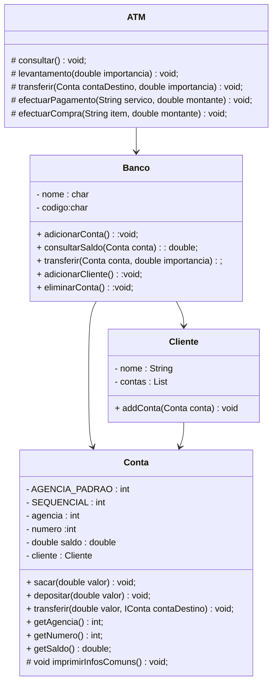

# Dio-projecto-banco-digital

Autor:

- [josue.dosidian](https://github.com/Koder012)
- e-mainl: <josue.dosididan@gmail.com> 

## projecto 

O projecto mostra a estrutura modificada a partir do projecto proposto pela dio. Como parte da extensão do projecto, apenas fiz uma anlise estrutural do projecto adicionando um ATM ao programa.

## Objectivo 
O Objectivo é de modelar algumas funcionalidades de um ATM. Modelando as operações:
- `levantamento(double montante)`
- `consultarSaldo()`
- `transferir(Conta contaDestino, double importancia)`
- `efectuarPagamento(String servico, double preco)`
- `efectuarCompra(String item, double preco)`

A operações citadas acima representam algumas das funcionalidades do projecto final.

## Diagrama de classes

## Diagrama de classes

